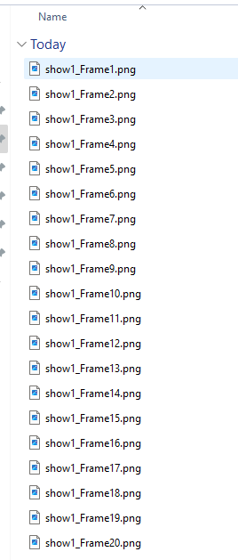

    Python Train_TSCUNet.py

    Python Train_TSCUNet.py --Checkpoint Dataset/Models/Checkpoint_Epoch.py

    I provided a script called VidToFrames.py which will extract the frames from video for you and rename them. Frames must be in multiples of 5 and if you don't use the script they must be named as shown below

 

